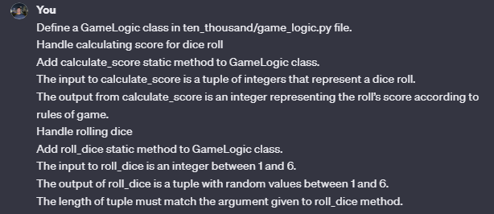
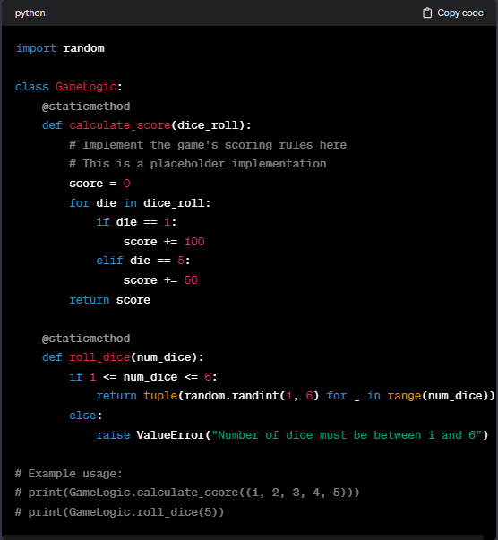
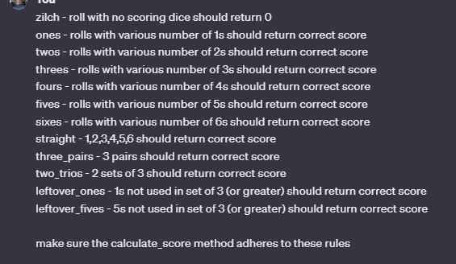
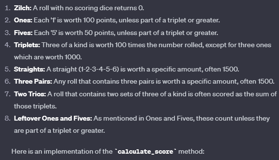
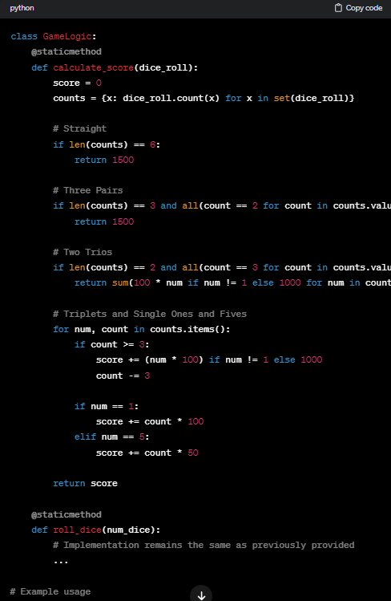
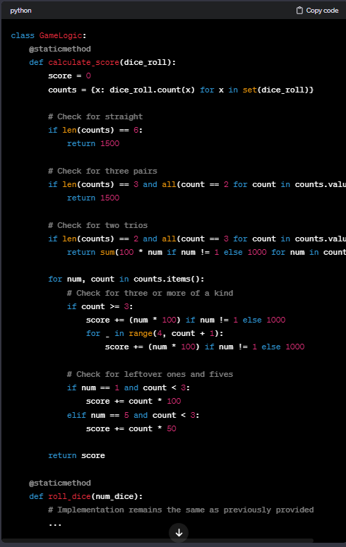

# My prompts to ChatGPT for Lab 06

## First Prompt

### ChatGPT's Response to my first Prompt:

- GameLogic Class

- `calculate_score` Method

**Input:**
- A tuple of integers representing a dice roll.

**Output:**
- An integer representing the score of the dice roll.

**Description:**
- This method calculates the score based on the rules of the game. Specific game rules need to be defined or known to implement this method accurately.

- `roll_dice` Method

**Input:**
- An integer between 1 and 6, representing the number of dice to roll.

**Output:**
- A tuple of integers, each between 1 and 6, representing the result of each die rolled.

**Description:**
- This method generates a random number between 1 and 6 for each die rolled and returns the results in a tuple.

- This is what it came up with:

## Second Prompt

- I added the rules from the lab assignment:

### ChatGPT's response

- "To implement the calculate_score method according to the rules you've described, we need to handle various scoring scenarios for the game of Ten Thousand (also known as Farkle). Here's a breakdown of the rules and how they can be translated into code:"

- And the Code:

## Third Prompt

- I inputted all of the tests for `test_calculate_score.py` [test_calculate_score.py](./tests/test_calculate_score.py) and `test_roll_dice.py` [test_roll_dice.py](./tests/test_roll_dice.py)

### ChatGPT' response 

- The provided tests cover a wide range of scenarios for scoring in the Ten Thousand (Farkle) game. These tests include single dice scores, straights, various multiples, and special cases like three pairs and two trios.

- To ensure that the calculate_score method in your GameLogic class passes these tests, we need to adjust the implementation to handle these specific cases, especially for multiples like four, five, and six of a kind, which were not included in the initial implementation.

- Here's an updated version of the calculate_score method:

#### The Third response passed all tests